# GLS OF BABYSOC

Here is the step-by-step execution plan for running the  commands manually:
---
### **Step 1: Load the Top-Level Design and Supporting Modules**
```bash
yosys
```


Inside the Yosys shell, run:
```yosys
read_verilog /home/ananya123/VSDBabySoCC/VSDBabySoC/src/module/vsdbabysoc.v
read_verilog -I /home/ananya123/VSDBabySoCC/VSDBabySoC/src/include /home/ananya123/VSDBabySoCC/src/module/rvmyth.v
read_verilog -I /home/ananya123/VSDBabySoCC/VSDBabySoC/src/include /home/ananya123/VSDBabySoCC/src/module/clk_gate.v

```
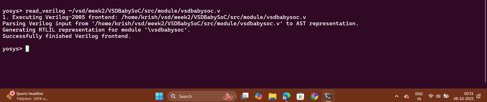

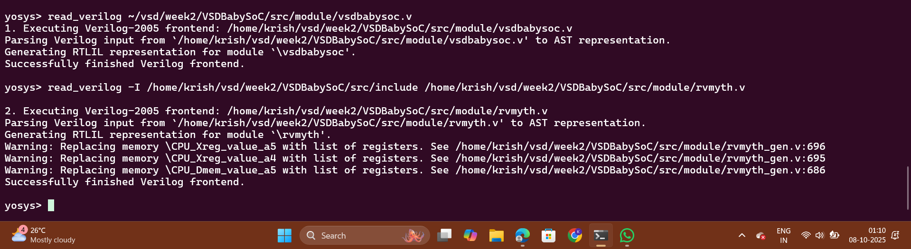

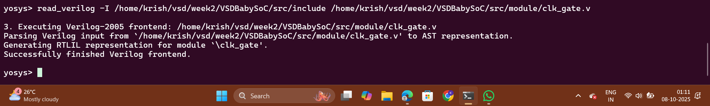

---

### **Step 2: Load the Liberty Files for Synthesis**
Inside the same Yosys shell, run:
```yosys
read_liberty -lib /home/ananya123/VSDBabySoCC/VSDBabySoC/src/lib/avsdpll.lib
read_liberty -lib /home/ananya123/VSDBabySoCC/VSDBabySoC/src/lib/avsddac.lib
read_liberty -lib /home/ananya123/VSDBabySoCC/VSDBabySoC/src/lib/sky130_fd_sc_hd__tt_025C_1v80.lib
```
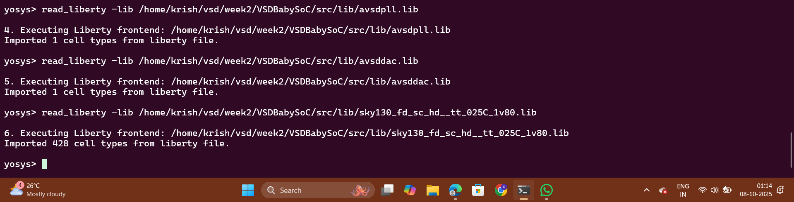

---

### **Step 3: Run Synthesis Targeting `vsdbabysoc`**
```yosys
synth -top vsdbabysoc
```
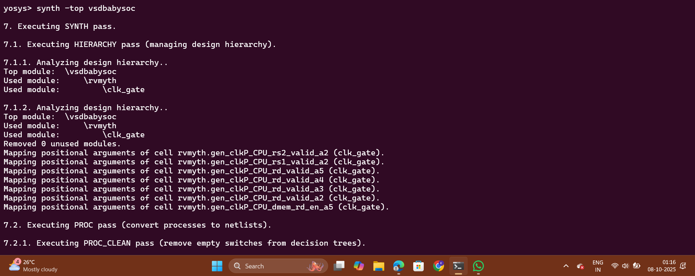
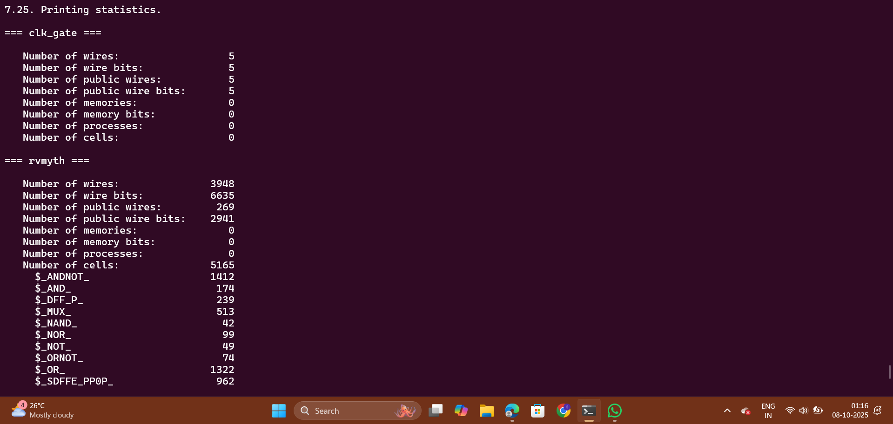
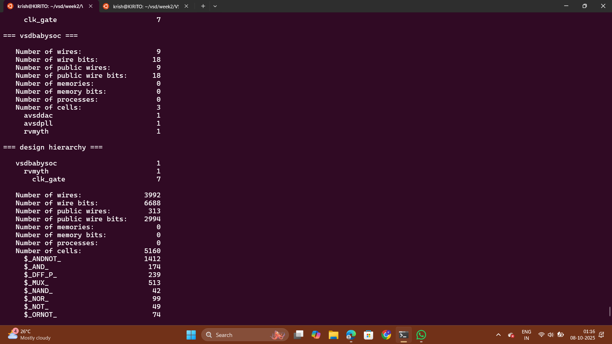
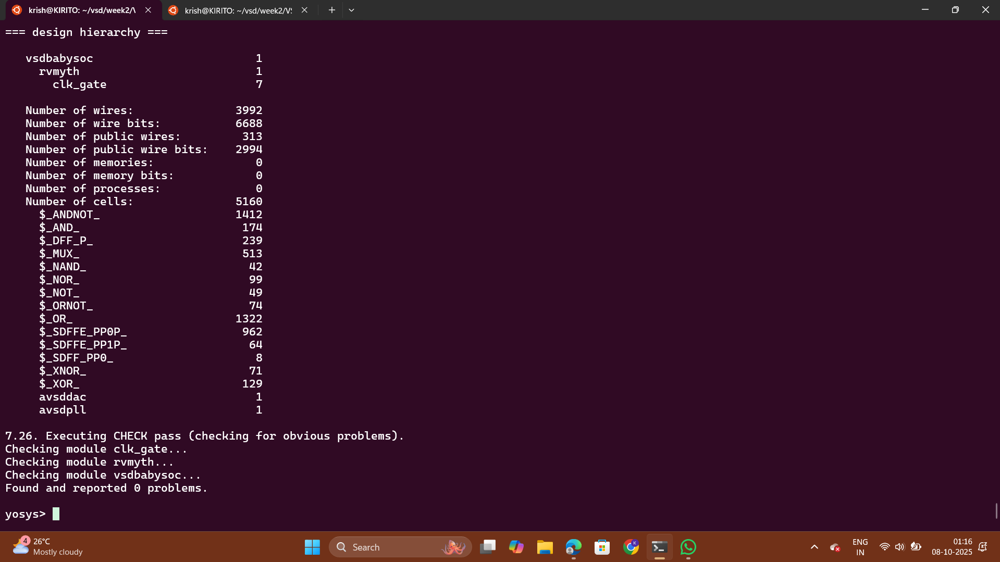

---

### **Step 4: Map D Flip-Flops to Standard Cells**
```yosys
dfflibmap -liberty /home/ananya123/VSDBabySoCC/VSDBabySoC/src/lib/sky130_fd_sc_hd__tt_025C_1v80.lib
```
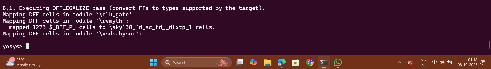

---

### **Step 5: Perform Optimization and Technology Mapping**
```yosys
opt
abc -liberty /home/ananya123/VSDBabySoCC/VSDBabySoC/src/lib/sky130_fd_sc_hd__tt_025C_1v80.lib -script +strash;scorr;ifraig;retime;{D};strash;dch,-f;map,-M,1,{D}
```
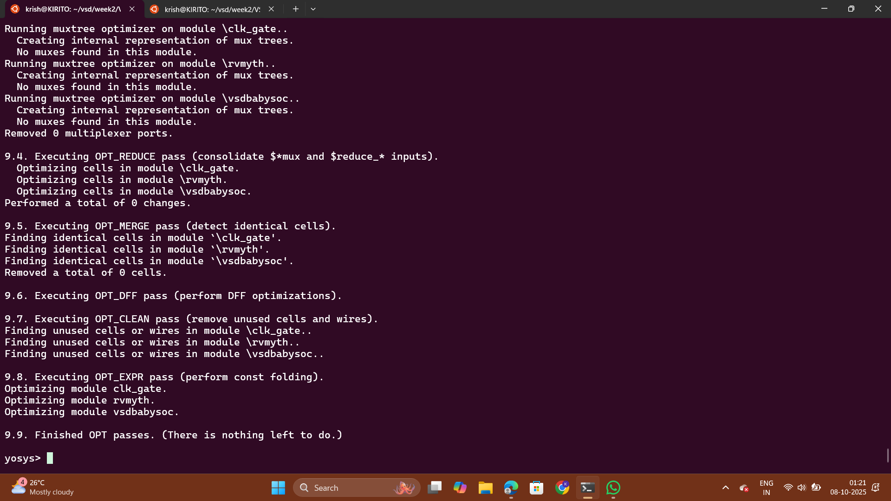
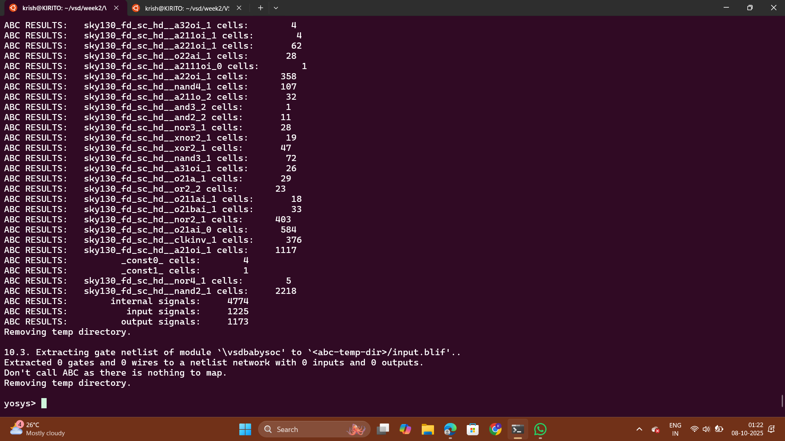

---

### **Step 6: Perform Final Clean-Up and Renaming**
```yosys
flatten
setundef -zero
clean -purge
rename -enumerate
```
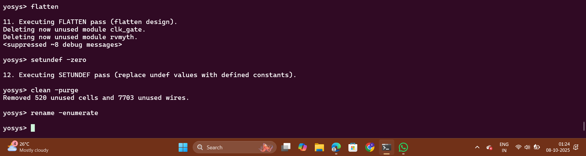

---

### **Step 7: Check Statistics**
```yosys
stat
```
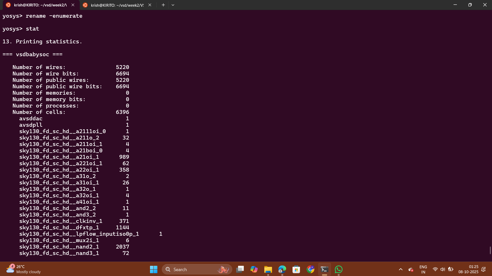
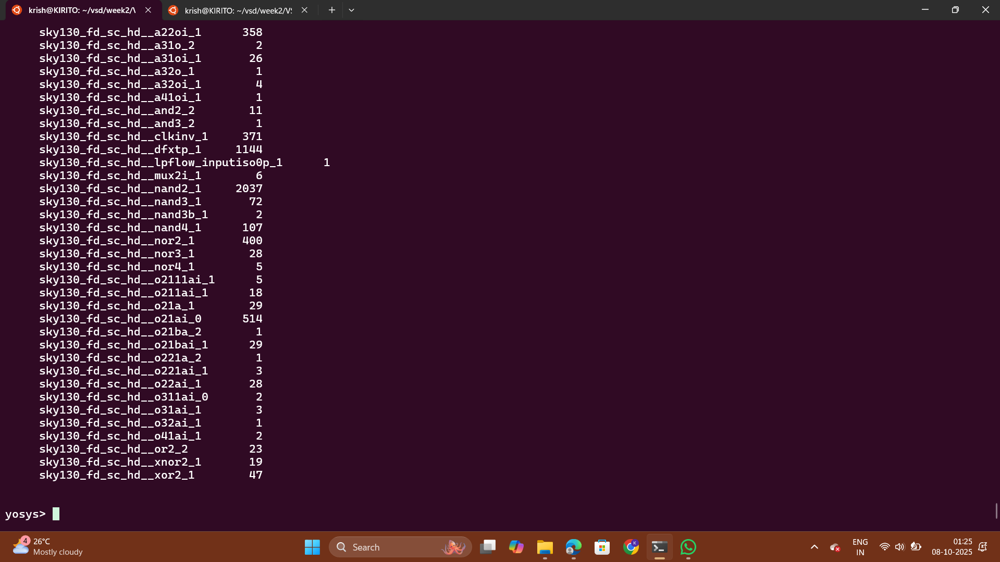

---

### **Step 8: Write the Synthesized Netlist**
```yosys
write_verilog -noattr /home/ananya123/VSDBabySoCC/VSDBabySoC/output/post_synth_sim/vsdbabysoc.synth.v
```
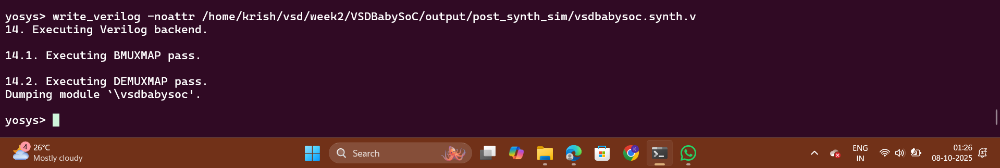

---

## POST_SYNTHESIS SIMULATION AND WAVEFORMS
---

### **Step 1: Compile the Testbench**
Run the following `iverilog` command to compile the testbench:
```bash
iverilog -o /home/ananya123/VSDBabySoCC/VSDBabySoC/output/post_synth_sim/post_synth_sim.out -DPOST_SYNTH_SIM -DFUNCTIONAL -DUNIT_DELAY=#1 -I /home/ananya123/VSDBabySoCC/VSDBabySoC/src/include -I /home/ananya123/VSDBabySoCC/VSDBabySoC/src/module /home/ananya123/VSDBabySoCC/VSDBabySoC/src/module/testbench.v
```
---
### **Step 2: Navigate to the Post-Synthesis Simulation Output Directory**
```bash
cd output/post_synth_sim/
```
---
### **Step 3: Run the Simulation**

```bash
./post_synth_sim.out
```
---
### **Step 4: View the Waveforms in GTKWave**

```bash
gtkwave post_synth_sim.vcd
```
---
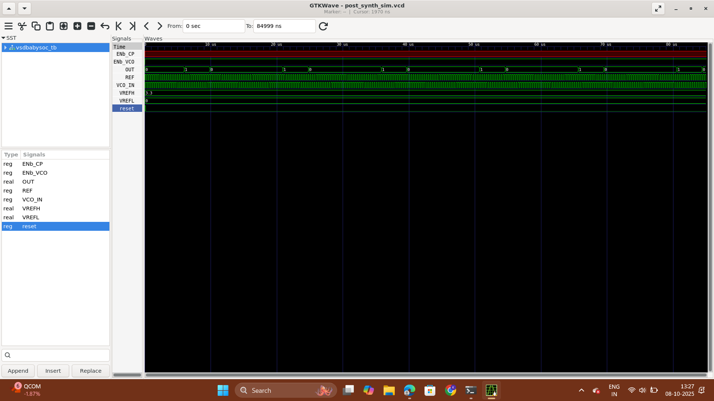
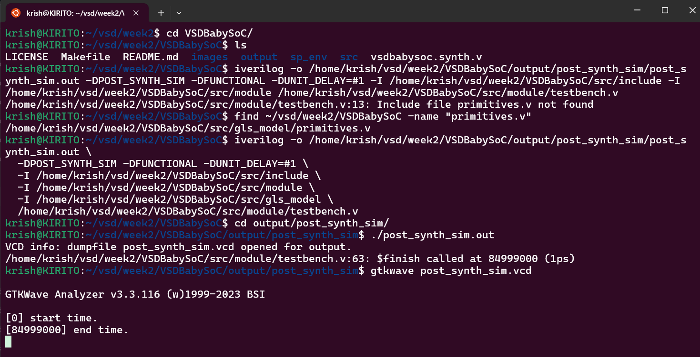
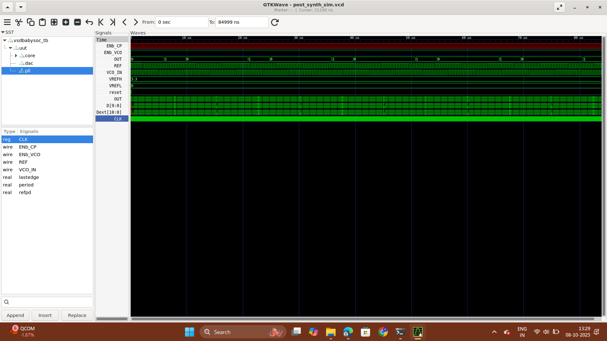
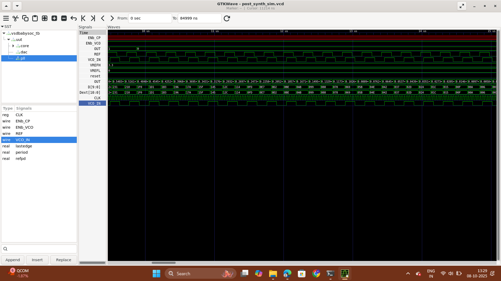

