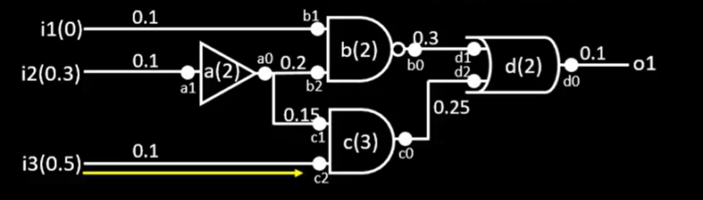

# Timing path 

A timing path is a chain of connected logic elements through which a signal propagates.

## ⏱️ What is Arrival Time?

The **arrival time (AT)** is the **actual time** at which a signal reaches a particular point (usually the **endpoint**) in the circuit.

### Required Time 
Allowed time for signal arrival

## Slack 
It is the difference btw arrival and expected time for a signal

-   **Max Slack** → Computed for **maximum delay (setup path)** → Slackmin​=Arrival Time−Required Time
    
-   **Min Slack** → Computed for **minimum delay (hold path)** → Slackmax​\=Required Time−Arrival Time
    
-   **Negative Slack** → Timing violation
    
-   **Positive Slack** → Timing met

## types of setup/hold analyis

 - reg2reg
 - in2reg
 - reg2out
 - in2out
 - clock gating
 - recovery/removal
 - data-to-data
 - latch(time borrow/time given)

showing the recovery/removal path

showing the clock gating path

showing the data to data path

showing the latch(time borrow/time given)

## Skew/Transition analysis

 - Data(max/min)
 -  clock(max/min)
## Load Analysis
 - Fanout(max/min)
 - Capacitance(max/min)
## Clock Analysis
 - skew
 - pulse width

# Actual Arrival Time
time at any node where we see latest transition after first rise clock edge
### for timing analysis we convert logic gates to nodes

# Required Arrival Time
time at any node where we expect latest transition within clock cycle

## Slack = RAT - AAT

AAT is expected to be less thn RAT at every node to meet design expectations

## GBA = graph based analysis   
takes all worst case paths
## PBA = path based analysis
takes real path or actual path traced on silicon

## Pin Node Convention
for more accurate analysis it should be used here the pins of the gates are considered

## Setup max path analysis tells us that combinational delay should be less than the time period
## Transistor level implementation

it shows how the flop is made up of mux which is negative latch i.e. when clk is low then the input is latched

it shows how the flop is made up of mux which is positive latch i.e. when clk is high then the input is latched

# Positive edge  triggered flip flop using master slave configuration
 - When CLK is 'low', “Tr1” and “Tr3” turns ON. Hence, input ‘D’ is latched to output ‘Qm’ of negative latch.
 - Inv4, Inv6' holds the 'Q' state of slave positive latch
 - Also,  D , is ready at output of 'Inv5', to propagate till 'Q', when CLK becomes 'high
 - Setup Time is the time before rising edge of CLK, that input D become valid i.e. 'D' input has to be stable such that Qm is sent out, to Q reliably
 - Input 'D' takes at least 3 inverter delays (Inv1, Inv3 and Inv5/Inv2) + 1 transmission gate delay (Tr1) to become stable before rising edge of CLK
 - Setup Time = 3 Inverter delay + 1 Transmission gate delay
 - When CLK is 'high', “Tr2” and “Tr4” turns ON. Hence, input ‘Qm’ (which is 'D' input from previous 'low' CLK) is latched to output 'Q' of negative latch, through 'Tr4' and 'Inv6
 - Inv2, Inv3 holds the 'Qm' state of master negative latch
 - Clk-Q = 1 transmission gate delay + 1 inverter delay
 - Hold Time is the time for which 'D' input remain valid after clock edge. In this case, 'Tr1' is OFF after rising 'CLK'. So, 'D' is allowed to change OR can change, immediately after rise 'CLK' edge. So Hold time is 'zero
 - Hence finite Time 'S' required (before clk edge) for 'D' to reach Q  i.e. internal delay of Mux1 = Setup time

# Jitter
Jitter is the short-term variation or deviation in the timing of a signal’s transitions from their ideal positions in time.
## Eye Diagram
An eye diagram is a superimposed plot of multiple signal waveforms in a digital system over one bit period.

# Hold Analysis
 - Hold analysis ensures data remains stable after the capturing clock edge.
 - Hold Slack = Arrival Time − Required Time

