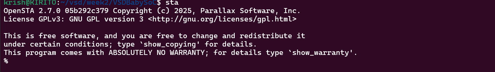
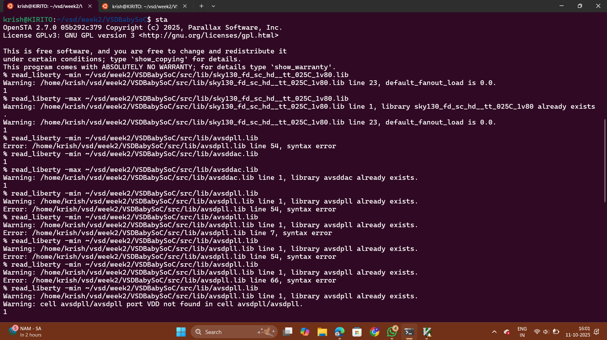
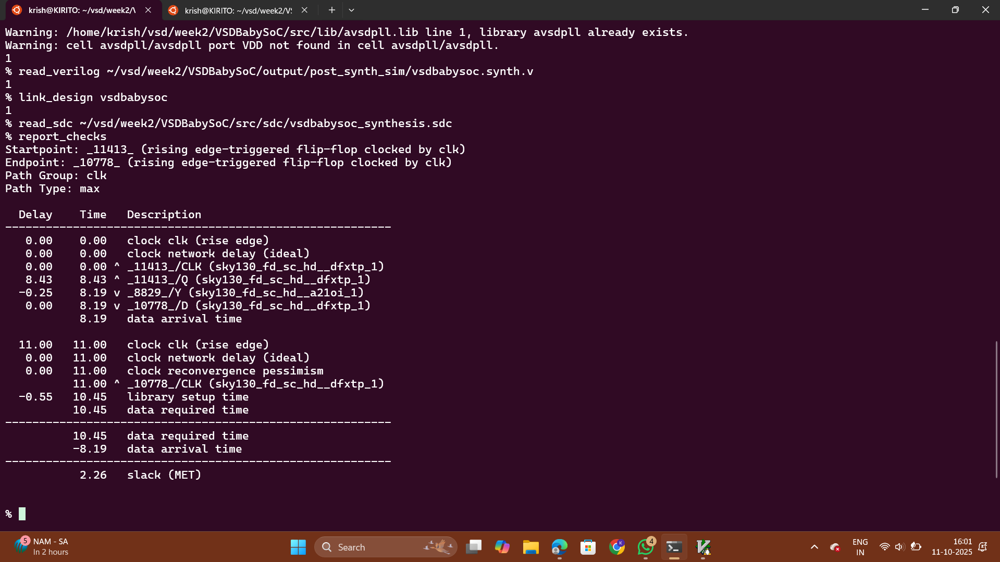
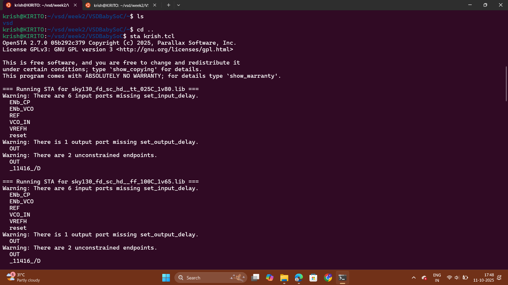
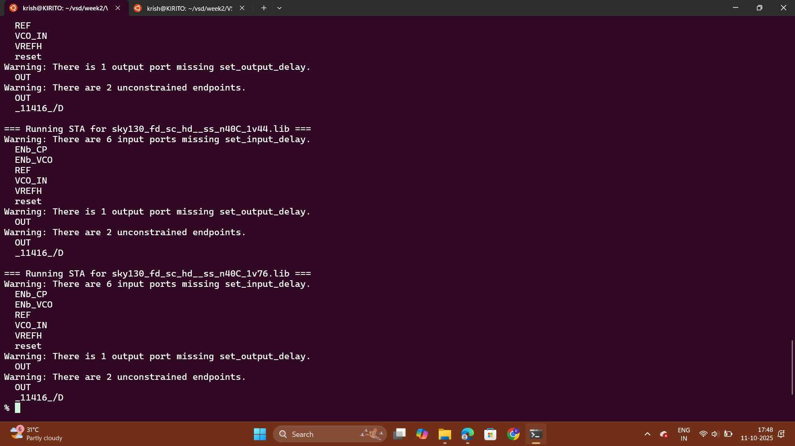
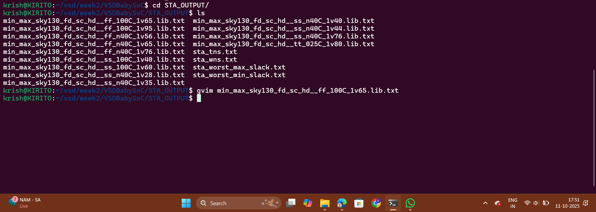
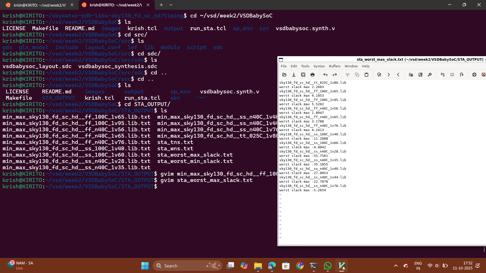
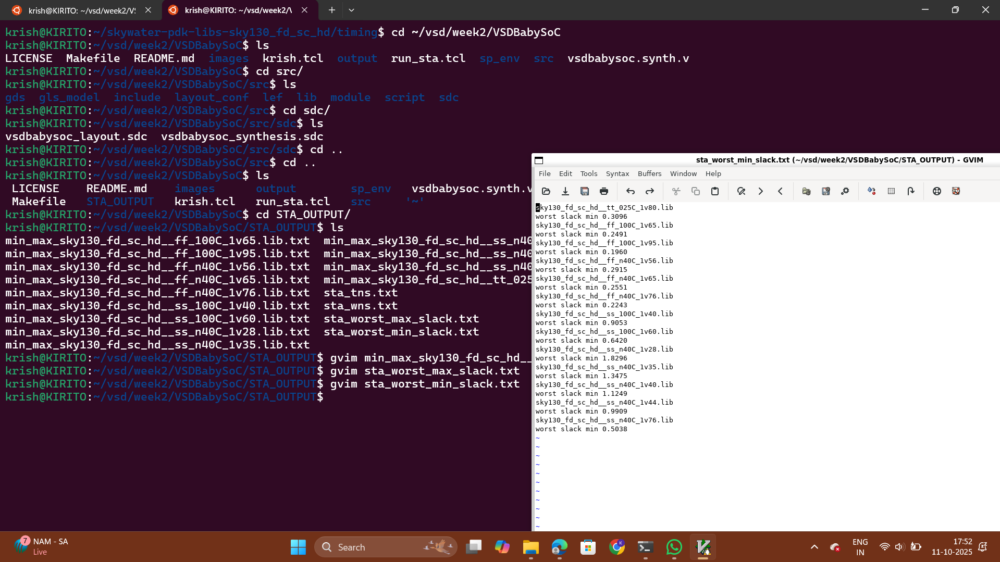
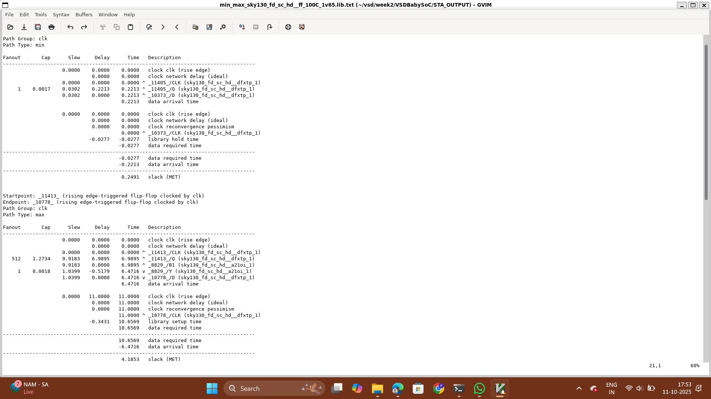

# Generate Timing Graphs Using OPENSTA

#### VSDBabySoC basic timing analysis
```
# -----------------------------
# OpenSTA Timing Analysis Script
# -----------------------------

# Load standard cell libraries
read_liberty -min /home/krish/vsd/week2/VSDBabySoC/src/lib/sky130_fd_sc_hd__tt_025C_1v80.lib
read_liberty -max /home/krish/vsd/week2/VSDBabySoC/src/lib/sky130_fd_sc_hd__tt_025C_1v80.lib

# Load additional IP libraries
read_liberty -min /home/krish/vsd/week2/VSDBabySoC/src/lib/avsdpll.lib
read_liberty -max /home/krish/vsd/week2/VSDBabySoC/src/lib/avsdpll.lib
read_liberty -min /home/krish/vsd/week2/VSDBabySoC/src/lib/avsddac.lib
read_liberty -max /home/krish/vsd/week2/VSDBabySoC/src/lib/avsddac.lib

# Load the synthesized netlist
read_verilog /home/krish/vsd/week2/VSDBabySoC/output/post_synth_sim/vsdbabysoc.synth.v

# Link the design
link_design vsdbabysoc

# Read the timing constraints
read_sdc /home/krish/vsd/week2/VSDBabySoC/src/sdc/vsdbabysoc_synthesis.sdc

# Make sure output folder exists
exec mkdir -p /home/krish/vsd/week2/VSDBabySoC/STA_OUTPUT

# Generate timing report
report_checks -path_delay min_max -fields {nets cap slew input_pins fanout} -digits 4 > /home/krish/vsd/week2/VSDBabySoC/STA_OUTPUT/timing_report.txt

puts "✅ Timing analysis complete. Report saved to STA_OUTPUT/timing_report.txt"

```




# Observation
The key takeaway is the final result:

-   Slack (MET): 2.26
    

Since the slack is a positive value (2.26 ns), it means the setup timing requirement has been met (MET). The data arrives 2.26 ns earlier than it is required to at the destination flip-flop, indicating a good timing margin for this path
     
### **VSDBabySoC PVT Corner Analysis (Post-Synthesis Timing)**  
STA is performed across all PVT corners to validate that the design meets timing requirements.

The worst max path (Setup-critical) corners in sub-40nm nodes are generally:  
- **ss_LowTemp_LowVolt**  
- **ss_HighTemp_LowVolt** *(Slowest corners)*  

The worst min path (Hold-critical) corners are:  
- **ff_LowTemp_HighVolt**  
- **ff_HighTemp_HighVolt** *(Fastest corners)*  

The following TCL script can be executed to perform STA for the available PVT corners using the Sky130 timing libraries.  
The timing libraries can be downloaded from:  
[https://github.com/efabless/skywater-pdk-libs-sky130_fd_sc_hd/tree/master/timing](https://github.com/efabless/skywater-pdk-libs-sky130_fd_sc_hd/tree/master/timing)  

#### the TCL file is 
```
# Define list of Liberty files for PVT corners
set list_of_lib_files(1) "sky130_fd_sc_hd__tt_025C_1v80.lib"
set list_of_lib_files(2) "sky130_fd_sc_hd__ff_100C_1v65.lib"
set list_of_lib_files(3) "sky130_fd_sc_hd__ff_100C_1v95.lib"
set list_of_lib_files(4) "sky130_fd_sc_hd__ff_n40C_1v56.lib"
set list_of_lib_files(5) "sky130_fd_sc_hd__ff_n40C_1v65.lib"
set list_of_lib_files(6) "sky130_fd_sc_hd__ff_n40C_1v76.lib"
set list_of_lib_files(7) "sky130_fd_sc_hd__ss_100C_1v40.lib"
set list_of_lib_files(8) "sky130_fd_sc_hd__ss_100C_1v60.lib"
set list_of_lib_files(9) "sky130_fd_sc_hd__ss_n40C_1v28.lib"
set list_of_lib_files(10) "sky130_fd_sc_hd__ss_n40C_1v35.lib"
set list_of_lib_files(11) "sky130_fd_sc_hd__ss_n40C_1v40.lib"
set list_of_lib_files(12) "sky130_fd_sc_hd__ss_n40C_1v44.lib"
set list_of_lib_files(13) "sky130_fd_sc_hd__ss_n40C_1v76.lib"

# Additional library files
read_liberty ~/vsd/week2/VSDBabySoC/src/lib/avsdpll.lib
read_liberty ~/vsd/week2/VSDBabySoC/src/lib/avsddac.lib

# Create output folder (if not exists)
exec mkdir -p ~/vsd/week2/VSDBabySoC/STA_OUTPUT

# Iterate over all Liberty files
for {set i 1} {$i <= [array size list_of_lib_files]} {incr i} {
    puts "\n=== Running STA for $list_of_lib_files($i) ==="

    read_liberty ~/skywater-pdk-libs-sky130_fd_sc_hd/timing/$list_of_lib_files($i)
    read_verilog ~/vsd/week2/VSDBabySoC/output/post_synth_sim/vsdbabysoc.synth.v
    link_design vsdbabysoc
    current_design
    read_sdc ~/vsd/week2/VSDBabySoC/src/sdc/vsdbabysoc_synthesis.sdc

    check_setup -verbose

    # Generate timing reports
    report_checks -path_delay min_max -fields {nets cap slew input_pins fanout} -digits 4 >  ~/vsd/week2/VSDBabySoC/STA_OUTPUT/min_max_$list_of_lib_files($i).txt

    exec echo "$list_of_lib_files($i)" >>  ~/vsd/week2/VSDBabySoC/STA_OUTPUT/sta_worst_max_slack.txt
    report_worst_slack -max -digits 4 >>  ~/vsd/week2/VSDBabySoC/STA_OUTPUT/sta_worst_max_slack.txt

    exec echo "$list_of_lib_files($i)" >>  ~/vsd/week2/VSDBabySoC/STA_OUTPUT/sta_worst_min_slack.txt
    report_worst_slack -min -digits 4 >>  ~/vsd/week2/VSDBabySoC/STA_OUTPUT/sta_worst_min_slack.txt

    exec echo "$list_of_lib_files($i)" >>  ~/vsd/week2/VSDBabySoC/STA_OUTPUT/sta_tns.txt
    report_tns -digits 4 >>  ~/vsd/week2/VSDBabySoC/STA_OUTPUT/sta_tns.txt

    exec echo "$list_of_lib_files($i)" >>  ~/vsd/week2/VSDBabySoC/STA_OUTPUT/sta_wns.txt
    report_wns -digits 4 >>  ~/vsd/week2/VSDBabySoC/STA_OUTPUT/sta_wns.txt
}

```









# Observation

 -  The worst setup slack is **violated** in the **SS (Slow-Slow) corner** at **-40°C** and **1.65 V**, with a slack of **-5.561 ns**. This corner is typically the most challenging for setup time.
